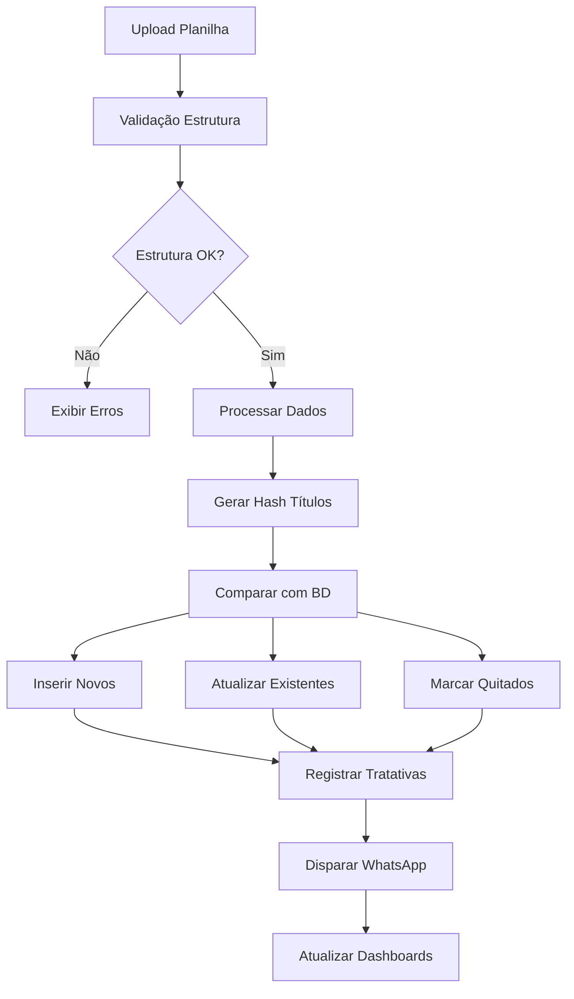

- `resposta_franqueado`
- `agendamento`
- `observacao_manual`
- `proposta_enviada`
- `proposta_aceita`
- `marcado_como_quitado`
- `negociacao_iniciada`
- `pagamento_parcial`
- `acordo_fechado`

**Canais**:
- `whatsapp`
- `calendly`
- `interno`
- `email`
- `telefone`
- `presencial`
- `outro`

#### `envios_mensagem`
**Descrição**: Log de todas as mensagens enviadas

| Campo | Tipo | Descrição |
|-------|------|-----------|
| `id` | UUID | Chave primária |
| `titulo_id` | UUID | FK para cobrancas_franqueados |
| `cliente` | TEXT | Nome do cliente |
| `cnpj` | TEXT | CNPJ do franqueado |
| `telefone` | TEXT | Telefone de destino |
| `data_envio` | TIMESTAMPTZ | Data/hora do envio |
| `mensagem_enviada` | TEXT | Conteúdo da mensagem |
| `status_envio` | TEXT | sucesso, falha, reagendado |
| `erro_detalhes` | TEXT | Detalhes do erro (se houver) |

#### `importacoes_planilha`
**Descrição**: Histórico de importações

| Campo | Tipo | Descrição |
|-------|------|-----------|
| `id` | UUID | Chave primária |
| `data_importacao` | TIMESTAMPTZ | Data/hora da importação |
| `usuario` | TEXT | Usuário responsável |
| `arquivo_nome` | TEXT | Nome do arquivo |
| `referencia` | TEXT | Referência única |
| `total_registros` | INTEGER | Total de registros processados |
| `novos_titulos` | INTEGER | Títulos novos criados |
| `titulos_atualizados` | INTEGER | Títulos atualizados |
| `titulos_quitados` | INTEGER | Títulos marcados como quitados |

#### `configuracoes_cobranca`
**Descrição**: Parâmetros configuráveis do sistema

| Campo | Tipo | Valor Padrão | Descrição |
|-------|------|--------------|-----------|
| `id` | TEXT | 'default' | Chave primária fixa |
| `percentual_multa` | NUMERIC | 2.0 | Percentual de multa (%) |
| `percentual_juros_dia` | NUMERIC | 0.033 | Juros diário (%) |
| `dia_disparo_mensal` | INTEGER | 15 | Dia do mês para disparo |
| `tempo_tolerancia_dias` | INTEGER | 3 | Dias de tolerância |
| `texto_padrao_mensagem` | TEXT | Template | Mensagem padrão |
| `link_base_agendamento` | TEXT | URL | Link do Calendly |
| `canal_envio` | TEXT | 'whatsapp' | Canal preferencial |
| `modo_debug` | BOOLEAN | false | Modo de debug |

### Cálculos Automáticos

#### Dias em Atraso
```sql
CASE 
  WHEN data_vencimento < CURRENT_DATE 
  THEN CURRENT_DATE - data_vencimento 
  ELSE 0 
END
```

#### Valor Atualizado
```sql
CASE 
  WHEN dias_em_atraso > 0 
  THEN valor_original + (valor_original * percentual_multa / 100) + (valor_original * percentual_juros_dia / 100 * dias_em_atraso)
  ELSE valor_original 
END
```

---

## 3. 📤 Ciclo de Atualização Semanal

### Fluxograma do Processo


### Detalhamento das Etapas

#### 1. Upload da Planilha
- **Formatos aceitos**: `.xlsx`, `.xml`
- **Colunas obrigatórias**: CLIENTE, CNPJ, VALOR, DATA_VENCIMENTO
- **Colunas opcionais**: VALOR_RECEBIDO, TELEFONE
- **Validações**: Formato de CNPJ, valores numéricos, datas válidas

#### 2. Validação da Planilha
```javascript
// Validações aplicadas:
- Estrutura de colunas
- Formato de dados
- CNPJ válido (14 dígitos)
- Valores positivos
- Datas no formato correto
```

#### 3. Geração de Hash Único
```javascript
// Fórmula do hash:
hash = SHA256(cnpj_limpo + "|" + valor_normalizado + "|" + data_normalizada)
```

#### 4. Comparação e Atualização
- **Títulos novos**: Status "novo" → Inserção no BD
- **Títulos existentes**: Atualização de valores e status
- **Títulos ausentes**: Marcação como "quitado"
- **Exceção**: Títulos em "negociando" não são alterados

#### 5. Registro de Tratativas
Cada operação gera entrada automática em `tratativas_cobranca`:
- Novos títulos: `tipo_interacao = 'novo_titulo'`
- Atualizações: `tipo_interacao = 'atualizacao_automatica'`
- Quitações: `tipo_interacao = 'marcado_como_quitado'`

#### 6. Disparo Automático WhatsApp
- **Critérios**: Status "em_aberto" + dias_em_atraso >= 1 + telefone válido
- **Mensagem**: Template configurável com variáveis
- **Log**: Registro em `envios_mensagem`

---

## 4. 💬 Mensagens e Comunicação

### Template Padrão de Cobrança
```
Olá, {{cliente}}!

Consta um débito da sua unidade, vencido em {{data_vencimento}}.
Valor atualizado até hoje: *{{valor_atualizado}}*

Deseja regularizar? {{link_negociacao}}

_Esta é uma mensagem automática do sistema de cobrança._
```

### Variáveis Disponíveis
- `{{cliente}}`: Nome do franqueado
- `{{valor_atualizado}}`: Valor com multa e juros
- `{{valor_original}}`: Valor original do título
- `{{data_vencimento}}`: Data de vencimento formatada
- `{{dias_atraso}}`: Quantidade de dias em atraso
- `{{link_negociacao}}`: URL do Calendly para agendamento

### Gatilhos de Envio
1. **Automático**: Após importação da planilha
2. **Manual**: Botão "Reenviar mensagem" no painel
3. **Reagendado**: Títulos com falha no envio

### Configuração do WhatsApp
- **API**: WhatsApp Business API (Meta)
- **Autenticação**: Token de acesso + Phone Number ID
- **Webhook**: Para confirmações de entrega (opcional)

### Agendamento Automático
- **Plataforma**: Calendly
- **Integração**: Link direto na mensagem
- **Registro**: Tratativa automática quando agendamento é feito

---

## 5. 📈 Dashboards e Monitoramento

### Dashboard Principal
**Métricas Principais**:
- Total em aberto vs. quitado vs. negociando
- Distribuição por faixas de atraso
- Ranking de unidades inadimplentes
- Evolução mensal de recebimentos

### Painel Operacional
**Funcionalidades**:
- Listagem completa de cobranças
- Filtros avançados (status, valor, data, CNPJ)
- Ações rápidas (quitar, observar, reenviar)
- Exportação de dados

### Filtros Disponíveis
- **Status**: em_aberto, quitado, negociando, cobrado, novo
- **Busca**: Por cliente ou CNPJ
- **Faixa de atraso**: 0-30, 31-90, 91-180, 180+ dias
- **Valores**: Mínimo e máximo
- **Período**: Data de vencimento
- **Estado**: UF (se disponível)

### Relatórios de Exportação
- **Formato**: CSV, Excel
- **Conteúdo**: Dados filtrados da tabela
- **Campos**: Todos os campos relevantes para análise

### Histórico de Tratativas
- **Visualização**: Timeline por cobrança
- **Filtros**: Por tipo, canal, usuário, período
- **Ações**: Adicionar observações manuais

---

## 6. 🧑‍💼 Perfis de Usuários

### Hierarquia de Permissões

#### `admin` - Administrador Total
**Permissões**:
- ✅ Acesso total ao sistema
- ✅ Configurações administrativas
- ✅ Gestão de usuários
- ✅ Importação de planilhas
- ✅ Todas as ações operacionais

#### `financeiro_master` - Gestor Financeiro
**Permissões**:
- ✅ Configurações do sistema
- ✅ Importação de planilhas
- ✅ Painel operacional completo
- ✅ Dashboards e relatórios
- ❌ Gestão de usuários

#### `financeiro_operador` - Operador Financeiro
**Permissões**:
- ✅ Painel operacional
- ✅ Tratativas e observações
- ✅ Dashboards básicos
- ❌ Configurações
- ❌ Importação de planilhas

#### `leitura` - Visualização
**Permissões**:
- ✅ Dashboards e relatórios
- ✅ Consulta de cobranças
- ❌ Alterações no sistema
- ❌ Ações operacionais

### Controle de Acesso (RLS)
```sql
-- Exemplo de política RLS
CREATE POLICY "Users can manage cobrancas data" 
ON cobrancas_franqueados 
FOR ALL 
TO authenticated 
USING (true) 
WITH CHECK (true);
```

---

## 7. 🆘 Manutenção e Suporte Técnico

### Informações do Sistema
- **Versão Atual**: 1.0.0
- **Última Atualização**: Janeiro 2025
- **Desenvolvido por**: Bolt AI + Equipe Técnica
- **Hospedagem**: Supabase + Netlify

### Contatos Responsáveis
- **Desenvolvimento**: [Inserir contato técnico]
- **Suporte Operacional**: [Inserir contato financeiro]
- **Administração**: [Inserir contato administrativo]

### Checklist em Caso de Erro na Importação

#### ❌ Erro: "Planilha com estrutura inválida"
1. Verificar se as colunas obrigatórias estão presentes
2. Conferir nomes das colunas (CLIENTE, CNPJ, VALOR, DATA_VENCIMENTO)
3. Validar formato do arquivo (.xlsx ou .xml)

#### ❌ Erro: "CNPJ inválido"
1. Verificar se CNPJs têm 14 dígitos
2. Remover caracteres especiais (pontos, barras, hífens)
3. Conferir se não há células vazias na coluna CNPJ

#### ❌ Erro: "Formato de data inválido"
1. Usar formato DD/MM/AAAA ou AAAA-MM-DD
2. Verificar se não há datas futuras inválidas
3. Conferir se células de data não estão como texto

#### ❌ Erro: "Falha no envio WhatsApp"
1. Verificar configurações da API (token, phone_number_id)
2. Conferir se telefones estão no formato correto
3. Validar se há créditos na conta WhatsApp Business

### Como Alterar Parâmetros do Sistema

#### Via Interface Administrativa
1. Acessar "Configurações Administrativas"
2. Alterar valores desejados
3. Clicar em "Salvar Alterações"
4. Confirmar aplicação imediata

#### Parâmetros Configuráveis
- **Percentual de multa**: 0-100%
- **Juros diário**: 0-10%
- **Dia do disparo**: 1-31
- **Tolerância**: 0-30 dias
- **Template de mensagem**: Texto livre com variáveis
- **Link de agendamento**: URL válida

### Backup e Recuperação
- **Backup automático**: Supabase (diário)
- **Exportação manual**: Via interface administrativa
- **Recuperação**: Contatar suporte técnico

### Monitoramento de Performance
- **Métricas**: Tempo de resposta, taxa de erro
- **Logs**: Supabase Dashboard
- **Alertas**: Configurados para falhas críticas

### Atualizações do Sistema
- **Frequência**: Conforme necessidade
- **Processo**: Deploy automático via Git
- **Rollback**: Disponível em caso de problemas

---

## 📞 Suporte e Contato

Para dúvidas, problemas ou sugestões:

- **Suporte Técnico**: [email/telefone]
- **Documentação**: Este arquivo (sempre atualizado)
- **Treinamento**: Disponível sob demanda

---

*Documento atualizado em: Janeiro 2025*
*Versão: 1.0.0*