# Deploy em Produção - Sistema de Cobrança

## 🚀 Arquitetura de Produção

```mermaid
graph TB
    subgraph "Frontend"
        A[React App] --> B[Netlify/Vercel]
    end
    
    subgraph "Backend"
        C[Supabase] --> D[PostgreSQL]
        C --> E[Auth]
        C --> F[Storage]
    end
    
    subgraph "Automação"
        G[n8n] --> H[Docker Container]
        G --> I[Cron Jobs]
    end
    
    subgraph "Integrações"
        J[WhatsApp API] --> K[Meta Business]
        L[Calendly API] --> M[Webhooks]
        N[Email] --> O[SendGrid/SMTP]
    end
    
    A --> C
    G --> C
    G --> J
    G --> L
    G --> N
```



## 🔧 Configuração do Ambiente

### 1. Supabase (Backend)

#### Configuração do Projeto
```sql
-- Configurações de produção
ALTER DATABASE postgres SET timezone TO 'America/Sao_Paulo';
ALTER DATABASE postgres SET log_statement TO 'all';

-- Configurar RLS em todas as tabelas
ALTER TABLE cobrancas_franqueados ENABLE ROW LEVEL SECURITY;
ALTER TABLE tratativas_cobranca ENABLE ROW LEVEL SECURITY;
ALTER TABLE unidades_franqueadas ENABLE ROW LEVEL SECURITY;
-- ... outras tabelas
```

#### Variáveis de Ambiente
```env
# Supabase
VITE_SUPABASE_URL=https://seu-projeto.supabase.co
VITE_SUPABASE_ANON_KEY=sua-chave-publica
SUPABASE_SERVICE_ROLE_KEY=sua-chave-servico

# WhatsApp Business API
VITE_WHATSAPP_TOKEN=seu-token-permanente
VITE_WHATSAPP_PHONE_NUMBER_ID=seu-phone-id

# URLs
VITE_PAINEL_FRANQUEADO_URL=https://painel.crescieperdi.com
VITE_AGENDAMENTO_URL=https://calendly.com/crescieperdi
```

### 2. Frontend (React + Vite)

#### Build para Produção
```bash
# Instalar dependências
npm install

# Build otimizado
npm run build

# Preview local
npm run preview
```

#### Deploy Netlify
```toml
# netlify.toml
[build]
  publish = "dist"
  command = "npm run build"

[build.environment]
  NODE_VERSION = "18"

[[redirects]]
  from = "/*"
  to = "/index.html"
  status = 200

[[headers]]
  for = "/assets/*"
  [headers.values]
    Cache-Control = "max-age=31536000"
```

#### Deploy Vercel
```json
{
  "version": 2,
  "builds": [
    {
      "src": "package.json",
      "use": "@vercel/static-build",
      "config": {
        "distDir": "dist"
      }
    }
  ],
  "routes": [
    {
      "handle": "filesystem"
    },
    {
      "src": "/(.*)",
      "dest": "/index.html"
    }
  ]
}
```

### 3. n8n (Automação)

#### Docker Compose Produção
```yaml
version: '3.8'

services:
  n8n:
    image: n8nio/n8n:latest
    restart: unless-stopped
    ports:
      - "5678:5678"
    environment:
      - N8N_HOST=n8n.crescieperdi.com
      - N8N_PORT=5678
      - N8N_PROTOCOL=https
      - NODE_ENV=production
      - WEBHOOK_URL=https://n8n.crescieperdi.com
      - N8N_BASIC_AUTH_ACTIVE=true
      - N8N_BASIC_AUTH_USER=${N8N_USER}
      - N8N_BASIC_AUTH_PASSWORD=${N8N_PASSWORD}
      - N8N_ENCRYPTION_KEY=${N8N_ENCRYPTION_KEY}
      - DB_TYPE=postgresdb
      - DB_POSTGRESDB_HOST=${DB_HOST}
      - DB_POSTGRESDB_PORT=5432
      - DB_POSTGRESDB_DATABASE=${DB_NAME}
      - DB_POSTGRESDB_USER=${DB_USER}
      - DB_POSTGRESDB_PASSWORD=${DB_PASSWORD}
      - N8N_METRICS=true
      - N8N_LOG_LEVEL=info
      - N8N_LOG_OUTPUT=console,file
      - N8N_LOG_FILE_LOCATION=/home/node/logs/
      # Variáveis do sistema
      - SUPABASE_URL=${SUPABASE_URL}
      - SUPABASE_SERVICE_KEY=${SUPABASE_SERVICE_KEY}
      - WHATSAPP_TOKEN=${WHATSAPP_TOKEN}
      - WHATSAPP_PHONE_ID=${WHATSAPP_PHONE_ID}
      - SLACK_TOKEN=${SLACK_TOKEN}
      - SENDGRID_API_KEY=${SENDGRID_API_KEY}
      - CALENDLY_TOKEN=${CALENDLY_TOKEN}
    volumes:
      - n8n_data:/home/node/.n8n
      - n8n_logs:/home/node/logs
    depends_on:
      - postgres
    networks:
      - n8n-network

  postgres:
    image: postgres:15
    restart: unless-stopped
    environment:
      - POSTGRES_USER=${DB_USER}
      - POSTGRES_PASSWORD=${DB_PASSWORD}
      - POSTGRES_DB=${DB_NAME}
    volumes:
      - postgres_data:/var/lib/postgresql/data
    networks:
      - n8n-network

  nginx:
    image: nginx:alpine
    restart: unless-stopped
    ports:
      - "80:80"
      - "443:443"
    volumes:
      - ./nginx.conf:/etc/nginx/nginx.conf
      - ./ssl:/etc/nginx/ssl
    depends_on:
      - n8n
    networks:
      - n8n-network

volumes:
  n8n_data:
  n8n_logs:
  postgres_data:

networks:
  n8n-network:
    driver: bridge
```

#### Nginx Configuration
```nginx
events {
    worker_connections 1024;
}

http {
    upstream n8n {
        server n8n:5678;
    }

    server {
        listen 80;
        server_name n8n.crescieperdi.com;
        return 301 https://$server_name$request_uri;
    }

    server {
        listen 443 ssl http2;
        server_name n8n.crescieperdi.com;

        ssl_certificate /etc/nginx/ssl/cert.pem;
        ssl_certificate_key /etc/nginx/ssl/key.pem;

        location / {
            proxy_pass http://n8n;
            proxy_set_header Host $host;
            proxy_set_header X-Real-IP $remote_addr;
            proxy_set_header X-Forwarded-For $proxy_add_x_forwarded_for;
            proxy_set_header X-Forwarded-Proto $scheme;
            
            # WebSocket support
            proxy_http_version 1.1;
            proxy_set_header Upgrade $http_upgrade;
            proxy_set_header Connection "upgrade";
        }
    }
}
```

## 🔐 Segurança

### 1. Supabase Security

#### Row Level Security (RLS)
```sql
-- Política para cobranças
CREATE POLICY "Users can manage cobrancas data" 
ON cobrancas_franqueados 
FOR ALL 
TO authenticated 
USING (true) 
WITH CHECK (true);

-- Política para franqueados (acesso próprio)
CREATE POLICY "Franqueados can access own data" 
ON cobrancas_franqueados 
FOR SELECT 
TO authenticated 
USING (cnpj = current_setting('app.current_cnpj', true));
```

#### API Keys
```env
# Produção - usar chaves específicas
SUPABASE_ANON_KEY=eyJ... # Chave pública
SUPABASE_SERVICE_ROLE_KEY=eyJ... # Chave privada (apenas backend)
```

### 2. WhatsApp Business API

#### Configuração Segura
```env
# Token permanente (não de teste)
WHATSAPP_TOKEN=EAAx... # Token de produção
WHATSAPP_PHONE_ID=123... # Phone Number ID verificado

# Webhook verification
WHATSAPP_VERIFY_TOKEN=seu-token-verificacao-seguro
```

#### Webhook Security
```javascript
// Verificação de assinatura do webhook
const crypto = require('crypto');

function verifyWebhookSignature(payload, signature) {
  const expectedSignature = crypto
    .createHmac('sha256', process.env.WHATSAPP_APP_SECRET)
    .update(payload)
    .digest('hex');
  
  return signature === `sha256=${expectedSignature}`;
}
```

### 3. n8n Security

#### Autenticação
```env
# Autenticação básica
N8N_BASIC_AUTH_ACTIVE=true
N8N_BASIC_AUTH_USER=admin
N8N_BASIC_AUTH_PASSWORD=senha-muito-segura-123!

# Chave de criptografia
N8N_ENCRYPTION_KEY=chave-256-bits-muito-segura
```

#### HTTPS e SSL
```bash
# Gerar certificado SSL
openssl req -x509 -nodes -days 365 -newkey rsa:2048 \
  -keyout ssl/key.pem \
  -out ssl/cert.pem \
  -subj "/CN=n8n.crescieperdi.com"
```

## 📊 Monitoramento

### 1. Logs e Métricas

#### Supabase Logs
```sql
-- Criar tabela de logs do sistema
CREATE TABLE system_logs (
  id UUID DEFAULT gen_random_uuid() PRIMARY KEY,
  level TEXT NOT NULL, -- info, warning, error
  message TEXT NOT NULL,
  context JSONB,
  created_at TIMESTAMPTZ DEFAULT now()
);

-- Função para log
CREATE OR REPLACE FUNCTION log_system_event(
  p_level TEXT,
  p_message TEXT,
  p_context JSONB DEFAULT '{}'::jsonb
) RETURNS void AS $$
BEGIN
  INSERT INTO system_logs (level, message, context)
  VALUES (p_level, p_message, p_context);
END;
$$ LANGUAGE plpgsql;
```

#### n8n Monitoring
```javascript
// Node para métricas em cada workflow
{
  "name": "Log Metrics",
  "type": "n8n-nodes-base.function",
  "parameters": {
    "functionCode": `
      const metrics = {
        workflow: $workflow.name,
        execution_id: $execution.id,
        start_time: $execution.startedAt,
        items_processed: $input.all().length,
        success: true,
        timestamp: new Date().toISOString()
      };
      
      // Enviar para Supabase
      return [{ json: metrics }];
    `
  }
}
```

### 2. Alertas

#### Slack Alerts
```javascript
// Alerta para falhas críticas
{
  "name": "Alert Slack",
  "type": "n8n-nodes-base.slack",
  "parameters": {
    "channel": "#alerts",
    "text": "🚨 FALHA CRÍTICA no sistema de cobrança!\n\nWorkflow: {{ $workflow.name }}\nErro: {{ $json.error }}\nHorário: {{ $json.timestamp }}"
  }
}
```

#### Email Alerts
```javascript
// Email para administradores
{
  "name": "Email Alert",
  "type": "n8n-nodes-base.emailSend",
  "parameters": {
    "fromEmail": "alerts@crescieperdi.com",
    "toEmail": "admin@crescieperdi.com,ti@crescieperdi.com",
    "subject": "🚨 Falha no Sistema de Cobrança",
    "message": "Detectada falha crítica no sistema. Verificar logs imediatamente."
  }
}
```

## 🔄 Backup e Recuperação

### 1. Backup Supabase
```bash
#!/bin/bash
# Script de backup diário

DATE=$(date +%Y%m%d_%H%M%S)
BACKUP_DIR="/backups/supabase"

# Backup do banco
pg_dump $DATABASE_URL > "$BACKUP_DIR/backup_$DATE.sql"

# Backup dos arquivos (se houver)
# supabase storage download --recursive bucket_name "$BACKUP_DIR/files_$DATE/"

# Manter apenas últimos 30 dias
find $BACKUP_DIR -name "backup_*.sql" -mtime +30 -delete

echo "Backup concluído: backup_$DATE.sql"
```

### 2. Backup n8n
```bash
#!/bin/bash
# Backup dos workflows n8n

DATE=$(date +%Y%m%d_%H%M%S)
BACKUP_DIR="/backups/n8n"

# Backup do volume Docker
docker run --rm -v n8n_data:/data -v $BACKUP_DIR:/backup alpine \
  tar czf /backup/n8n_backup_$DATE.tar.gz -C /data .

# Backup do banco PostgreSQL do n8n
docker exec postgres pg_dump -U $DB_USER $DB_NAME > "$BACKUP_DIR/n8n_db_$DATE.sql"

echo "Backup n8n concluído: n8n_backup_$DATE.tar.gz"
```

## 📋 Checklist de Deploy

### Pré-Deploy
- [ ] Configurar domínios e DNS
- [ ] Obter certificados SSL
- [ ] Configurar variáveis de ambiente
- [ ] Testar todas as integrações em staging

### Deploy Backend
- [ ] Configurar projeto Supabase
- [ ] Executar migrations
- [ ] Configurar RLS e políticas
- [ ] Testar APIs

### Deploy Frontend
- [ ] Build da aplicação
- [ ] Deploy no Netlify/Vercel
- [ ] Configurar redirects
- [ ] Testar todas as páginas

### Deploy n8n
- [ ] Configurar servidor Docker
- [ ] Deploy dos containers
- [ ] Importar workflows
- [ ] Testar execuções

### Pós-Deploy
- [ ] Configurar monitoramento
- [ ] Configurar backups automáticos
- [ ] Testar fluxo completo
- [ ] Documentar URLs e acessos

## 🔧 Manutenção

### Rotinas Diárias
- Verificar logs de erro
- Monitorar execuções n8n
- Verificar status dos serviços

### Rotinas Semanais
- Analisar métricas de performance
- Verificar backups
- Revisar alertas

### Rotinas Mensais
- Atualizar dependências
- Revisar configurações de segurança
- Analisar custos de infraestrutura

## 📞 Suporte

### Contatos de Emergência
- **Administrador do Sistema**: admin@crescieperdi.com
- **Suporte Técnico**: ti@crescieperdi.com
- **Suporte Supabase**: https://supabase.com/support

### Documentação
- **Supabase**: https://supabase.com/docs
- **n8n**: https://docs.n8n.io
- **WhatsApp Business API**: https://developers.facebook.com/docs/whatsapp

### Logs Importantes
- **Supabase**: Dashboard > Logs
- **n8n**: Interface > Executions
- **Netlify**: Dashboard > Functions > Logs