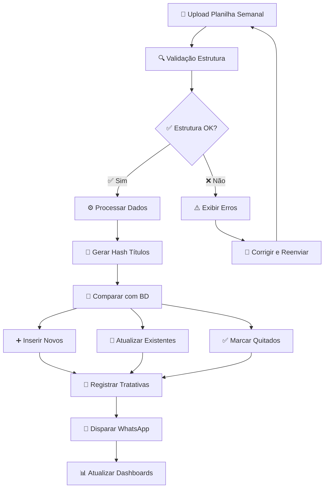
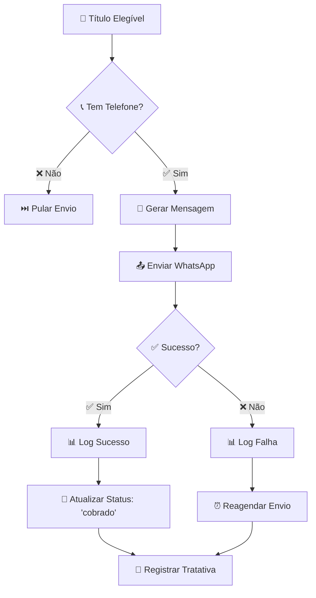
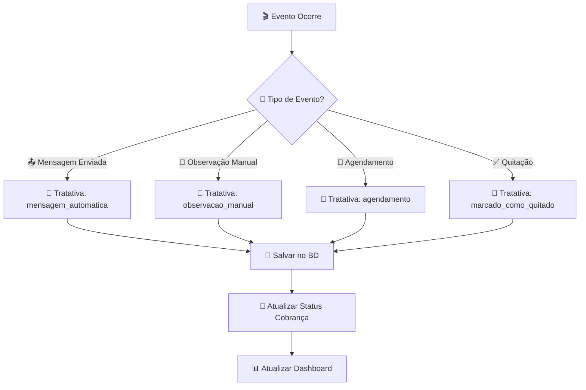
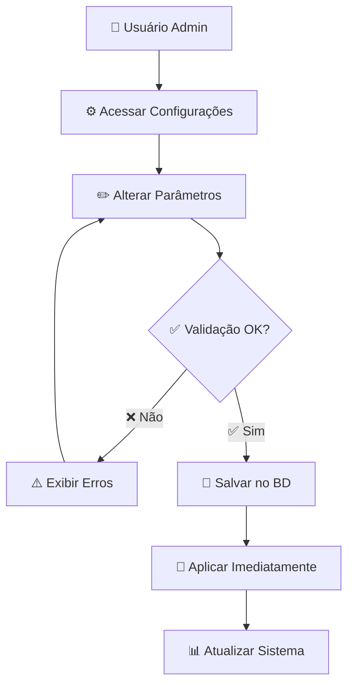
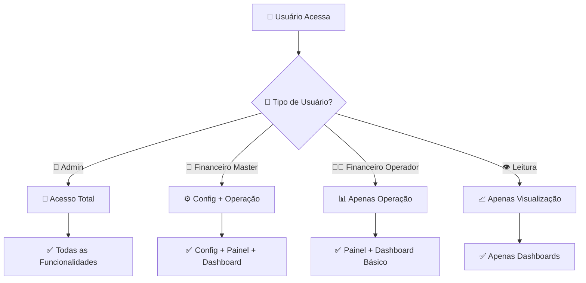
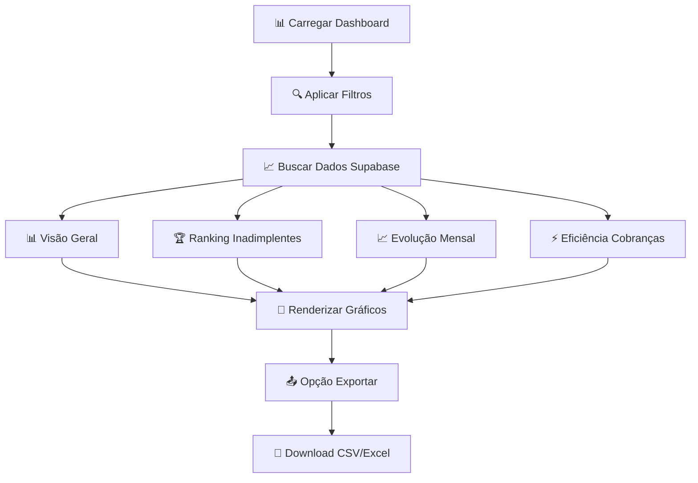
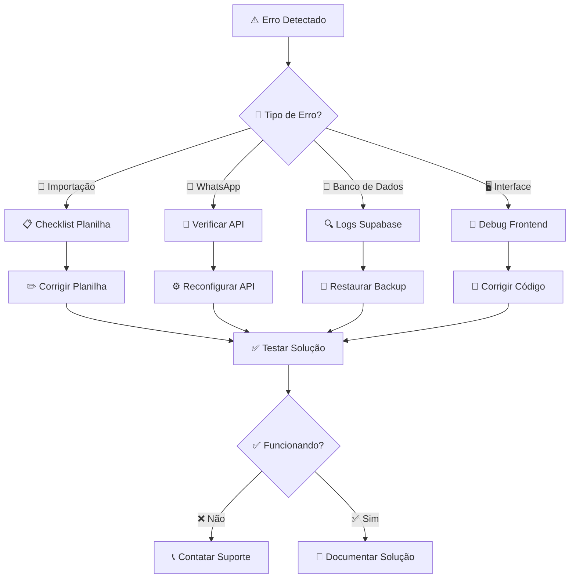

# Fluxogramas do Sistema de Cobrança

## 🔄 Ciclo Principal de Cobrança

## 📱 Fluxo de Envio WhatsApp

## 🎯 Fluxo de Tratativas

## ⚙️ Fluxo de Configurações

## 🔐 Fluxo de Permissões

## 📊 Fluxo do Dashboard

## 🛠️ Fluxo de Manutenção

