# Integração n8n - Sistema de Cobrança

## 🎯 Visão Geral da Arquitetura

```mermaid
graph TD
    A[Upload Planilha] --> B[n8n: Processar Excel]
    B --> C[n8n: Validar Dados]
    C --> D[Supabase: Upsert Cobranças]
    D --> E[n8n: Calcular Juros/Multa]
    E --> F[n8n: Filtrar Elegíveis]
    F --> G[WhatsApp API: Enviar Mensagens]
    G --> H[Supabase: Log Envios]
    
    I[Cron Diário] --> J[n8n: Verificar Escalonamentos]
    J --> K[Supabase: Criar Escalonamentos]
    K --> L[Slack: Notificar Jurídico]
    
    M[Cron Mensal] --> N[n8n: Gerar Relatório]
    N --> O[Supabase: Salvar Relatório]
    O --> P[Email: Enviar Diretoria]
    
    Q[Webhook Calendly] --> R[n8n: Registrar Reunião]
    R --> S[Supabase: Salvar Reunião]
    
    T[Painel Franqueado] --> U[Supabase: Consultar Dados]
    V[Dashboard Admin] --> U
```



## 🔧 Configuração dos Workflows

### 1. Workflow Principal: Processamento Semanal

**Arquivo**: `workflows/processamento-planilha.json`

```json
{
  "name": "Processamento Planilha Cobrança",
  "nodes": [
    {
      "parameters": {
        "path": "upload-planilha",
        "options": {}
      },
      "name": "Webhook Upload",
      "type": "n8n-nodes-base.webhook",
      "position": [240, 300]
    },
    {
      "parameters": {
        "operation": "read",
        "binaryPropertyName": "data",
        "options": {
          "headerRow": 1
        }
      },
      "name": "Read Spreadsheet",
      "type": "n8n-nodes-base.spreadsheetFile",
      "position": [460, 300]
    },
    {
      "parameters": {
        "functionCode": "// Validação e cálculo de juros\nconst items = [];\n\nfor (const item of $input.all()) {\n  const cnpj = item.json.CNPJ?.toString().replace(/\\D/g, '');\n  if (!cnpj || cnpj.length !== 14) continue;\n  \n  const valor = parseFloat(item.json.VALOR?.toString().replace(',', '.'));\n  if (!valor || valor <= 0) continue;\n  \n  const dataVencimento = new Date(item.json.DATA_VENCIMENTO);\n  if (isNaN(dataVencimento.getTime())) continue;\n  \n  const hoje = new Date();\n  const diasAtraso = Math.max(0, Math.floor((hoje - dataVencimento) / (1000 * 60 * 60 * 24)));\n  \n  let valorAtualizado = valor;\n  if (diasAtraso > 0) {\n    const multa = valor * 0.02; // 2%\n    const juros = valor * 0.00033 * diasAtraso; // 0.033% ao dia\n    valorAtualizado = valor + multa + juros;\n  }\n  \n  items.push({\n    json: {\n      cnpj: cnpj,\n      cliente: item.json.CLIENTE?.toString().trim(),\n      valor_original: valor,\n      valor_recebido: parseFloat(item.json.VALOR_RECEBIDO?.toString().replace(',', '.')) || 0,\n      data_vencimento: dataVencimento.toISOString().split('T')[0],\n      dias_em_atraso: diasAtraso,\n      valor_atualizado: valorAtualizado,\n      status: diasAtraso > 0 ? 'em_aberto' : 'novo',\n      referencia_importacao: `IMP_${Date.now()}`\n    }\n  });\n}\n\nreturn items;"
      },
      "name": "Validar e Calcular",
      "type": "n8n-nodes-base.function",
      "position": [680, 300]
    }
  ],
  "connections": {
    "Webhook Upload": {
      "main": [
        [
          {
            "node": "Read Spreadsheet",
            "type": "main",
            "index": 0
          }
        ]
      ]
    },
    "Read Spreadsheet": {
      "main": [
        [
          {
            "node": "Validar e Calcular",
            "type": "main",
            "index": 0
          }
        ]
      ]
    }
  }
}
```

### 2. Workflow: Envio Automático WhatsApp

**Arquivo**: `workflows/envio-whatsapp.json`

```json
{
  "name": "Envio Automático WhatsApp",
  "nodes": [
    {
      "parameters": {
        "rule": {
          "interval": [
            {
              "field": "cronExpression",
              "expression": "0 10 * * 1-5"
            }
          ]
        }
      },
      "name": "Cron Envio Diário",
      "type": "n8n-nodes-base.cron",
      "position": [240, 300]
    },
    {
      "parameters": {
        "resource": "rows",
        "operation": "getAll",
        "tableId": "cobrancas_franqueados",
        "filterType": "manual",
        "matchType": "allFilters",
        "filters": [
          {
            "field": "status",
            "operator": "eq",
            "value": "em_aberto"
          },
          {
            "field": "dias_em_atraso",
            "operator": "gte",
            "value": 1
          },
          {
            "field": "telefone",
            "operator": "neq",
            "value": null
          }
        ]
      },
      "name": "Buscar Títulos Elegíveis",
      "type": "n8n-nodes-base.supabase",
      "position": [460, 300]
    },
    {
      "parameters": {
        "functionCode": "const mensagens = [];\n\nfor (const item of $input.all()) {\n  const valorFormatado = new Intl.NumberFormat('pt-BR', {\n    style: 'currency',\n    currency: 'BRL'\n  }).format(item.json.valor_atualizado);\n  \n  const dataVencimento = new Date(item.json.data_vencimento).toLocaleDateString('pt-BR');\n  \n  const mensagem = `Olá, ${item.json.cliente}!\n\nConsta um débito da sua unidade, vencido em ${dataVencimento}.\nValor atualizado até hoje: *${valorFormatado}*\n\nDeseja regularizar? https://calendly.com/crescieperdi/negociacao\n\nAcesse seu painel: https://painel.crescieperdi.com/franqueado\n\n_Esta é uma mensagem automática do sistema de cobrança._`;\n  \n  mensagens.push({\n    json: {\n      titulo_id: item.json.id,\n      telefone: item.json.telefone.replace(/\\D/g, ''),\n      mensagem: mensagem,\n      cliente: item.json.cliente,\n      cnpj: item.json.cnpj\n    }\n  });\n}\n\nreturn mensagens;"
      },
      "name": "Gerar Mensagens",
      "type": "n8n-nodes-base.function",
      "position": [680, 300]
    },
    {
      "parameters": {
        "method": "POST",
        "url": "=https://graph.facebook.com/v18.0/{{ $env.WHATSAPP_PHONE_ID }}/messages",
        "authentication": "genericCredentialType",
        "genericAuthType": "httpHeaderAuth",
        "httpHeaderAuth": {
          "name": "Authorization",
          "value": "=Bearer {{ $env.WHATSAPP_TOKEN }}"
        },
        "sendBody": true,
        "bodyContentType": "json",
        "jsonBody": "={\n  \"messaging_product\": \"whatsapp\",\n  \"to\": \"55{{ $json.telefone }}\",\n  \"type\": \"text\",\n  \"text\": {\n    \"body\": \"{{ $json.mensagem }}\"\n  }\n}"
      },
      "name": "Enviar WhatsApp",
      "type": "n8n-nodes-base.httpRequest",
      "position": [900, 300]
    }
  ]
}
```

### 3. Workflow: Verificação de Escalonamentos

**Arquivo**: `workflows/verificacao-escalonamentos.json`

```json
{
  "name": "Verificação Escalonamentos",
  "nodes": [
    {
      "parameters": {
        "rule": {
          "interval": [
            {
              "field": "cronExpression", 
              "expression": "0 9 * * 1-5"
            }
          ]
        }
      },
      "name": "Cron Verificação",
      "type": "n8n-nodes-base.cron",
      "position": [240, 300]
    },
    {
      "parameters": {
        "functionCode": "// Executar função do Supabase para verificar critérios\nreturn [{\n  json: {\n    action: 'verificar_escalonamentos_lote'\n  }\n}];"
      },
      "name": "Preparar Verificação",
      "type": "n8n-nodes-base.function",
      "position": [460, 300]
    },
    {
      "parameters": {
        "resource": "rpc",
        "rpc": "verificar_escalonamentos_lote"
      },
      "name": "Executar Verificação",
      "type": "n8n-nodes-base.supabase",
      "position": [680, 300]
    },
    {
      "parameters": {
        "channel": "#juridico",
        "text": "=🚨 Verificação de escalonamentos concluída.\n\n{{ $json.novos_escalonamentos }} novos casos identificados.\n\nAcesse o painel para mais detalhes: https://sistema.crescieperdi.com/escalonamentos"
      },
      "name": "Notificar Slack",
      "type": "n8n-nodes-base.slack",
      "position": [900, 300]
    }
  ]
}
```

### 4. Workflow: Geração Relatório Mensal

**Arquivo**: `workflows/relatorio-mensal.json`

```json
{
  "name": "Relatório Mensal Automático",
  "nodes": [
    {
      "parameters": {
        "rule": {
          "interval": [
            {
              "field": "cronExpression",
              "expression": "0 8 1 * *"
            }
          ]
        }
      },
      "name": "Cron Mensal",
      "type": "n8n-nodes-base.cron",
      "position": [240, 300]
    },
    {
      "parameters": {
        "functionCode": "const mesAnterior = new Date();\nmesAnterior.setMonth(mesAnterior.getMonth() - 1);\nconst referencia = mesAnterior.toISOString().slice(0, 7);\n\nreturn [{\n  json: {\n    referencia_mes: referencia,\n    usuario: 'sistema_automatico'\n  }\n}];"
      },
      "name": "Preparar Dados",
      "type": "n8n-nodes-base.function",
      "position": [460, 300]
    },
    {
      "parameters": {
        "resource": "rpc",
        "rpc": "gerar_relatorio_mensal_automatico",
        "parameters": {
          "p_referencia_mes": "={{ $json.referencia_mes }}",
          "p_usuario": "={{ $json.usuario }}"
        }
      },
      "name": "Gerar Relatório",
      "type": "n8n-nodes-base.supabase",
      "position": [680, 300]
    },
    {
      "parameters": {
        "fromEmail": "sistema@crescieperdi.com",
        "toEmail": "diretoria@crescieperdi.com,juridico@crescieperdi.com",
        "subject": "=Relatório Mensal - {{ $('Preparar Dados').item.json.referencia_mes }}",
        "emailType": "html",
        "message": "=Prezados,\n\nSegue o relatório mensal consolidado de inadimplência da rede referente ao período {{ $('Preparar Dados').item.json.referencia_mes }}.\n\nO relatório está disponível no painel administrativo: https://sistema.crescieperdi.com/relatorios\n\nAtenciosamente,\nSistema de Cobrança Automatizada"
      },
      "name": "Enviar Email",
      "type": "n8n-nodes-base.emailSend",
      "position": [900, 300]
    }
  ]
}
```

## 🔗 Webhooks e Integrações

### Calendly Integration
```javascript
// Webhook para capturar agendamentos do Calendly
{
  "name": "Webhook Calendly",
  "type": "n8n-nodes-base.webhook",
  "parameters": {
    "path": "calendly-webhook",
    "httpMethod": "POST"
  }
}

// Processar agendamento
{
  "name": "Processar Agendamento",
  "type": "n8n-nodes-base.function",
  "parameters": {
    "functionCode": `
      const evento = $input.first().json.payload;
      
      return [{
        json: {
          email_franqueado: evento.invitee.email,
          data_agendada: evento.event.start_time,
          tipo_reuniao: 'negociacao',
          plataforma: 'calendly',
          link_reuniao: evento.event.location.join_url
        }
      }];
    `
  }
}
```

### Typebot Integration
```javascript
// Webhook para capturar respostas do Typebot
{
  "name": "Webhook Typebot",
  "type": "n8n-nodes-base.webhook", 
  "parameters": {
    "path": "typebot-response",
    "httpMethod": "POST"
  }
}

// Processar resposta do franqueado
{
  "name": "Processar Resposta",
  "type": "n8n-nodes-base.function",
  "parameters": {
    "functionCode": `
      const resposta = $input.first().json;
      
      return [{
        json: {
          cnpj: resposta.cnpj,
          tipo_resposta: resposta.tipo,
          conteudo: resposta.mensagem,
          canal: 'typebot',
          data_resposta: new Date().toISOString()
        }
      }];
    `
  }
}
```

## 📊 Monitoramento e Logs

### Dashboard de Execuções
```javascript
// Node para coletar métricas de execução
{
  "name": "Coletar Métricas",
  "type": "n8n-nodes-base.function",
  "parameters": {
    "functionCode": `
      const metricas = {
        workflow_id: $workflow.id,
        execution_id: $execution.id,
        data_execucao: new Date().toISOString(),
        status: 'sucesso',
        items_processados: $input.all().length,
        tempo_execucao: $execution.duration
      };
      
      return [{ json: metricas }];
    `
  }
}
```

### Alertas de Falha
```javascript
// Node para capturar erros
{
  "name": "Capturar Erro",
  "type": "n8n-nodes-base.function",
  "parameters": {
    "functionCode": `
      const erro = {
        workflow: $workflow.name,
        node: $node.name,
        erro: $input.first().json.error,
        timestamp: new Date().toISOString()
      };
      
      // Enviar para Slack ou email de alerta
      return [{ json: erro }];
    `
  }
}
```

## 🚀 Deploy e Configuração

### Docker Compose para n8n
```yaml
version: '3.8'
services:
  n8n:
    image: n8nio/n8n:latest
    ports:
      - "5678:5678"
    environment:
      - N8N_BASIC_AUTH_ACTIVE=true
      - N8N_BASIC_AUTH_USER=admin
      - N8N_BASIC_AUTH_PASSWORD=sua-senha-segura
      - WEBHOOK_URL=https://n8n.crescieperdi.com
      - SUPABASE_URL=${SUPABASE_URL}
      - SUPABASE_ANON_KEY=${SUPABASE_ANON_KEY}
      - WHATSAPP_TOKEN=${WHATSAPP_TOKEN}
      - WHATSAPP_PHONE_ID=${WHATSAPP_PHONE_ID}
      - SLACK_TOKEN=${SLACK_TOKEN}
    volumes:
      - n8n_data:/home/node/.n8n
    restart: unless-stopped

volumes:
  n8n_data:
```

### Configuração de Credenciais
```json
{
  "supabase": {
    "name": "Supabase Cresci e Perdi",
    "type": "supabase",
    "data": {
      "host": "{{ $env.SUPABASE_URL }}",
      "serviceRole": "{{ $env.SUPABASE_SERVICE_KEY }}"
    }
  },
  "whatsapp": {
    "name": "WhatsApp Business API",
    "type": "httpHeaderAuth",
    "data": {
      "name": "Authorization",
      "value": "Bearer {{ $env.WHATSAPP_TOKEN }}"
    }
  },
  "slack": {
    "name": "Slack Jurídico",
    "type": "slackApi",
    "data": {
      "accessToken": "{{ $env.SLACK_TOKEN }}"
    }
  }
}
```

## 📋 Checklist de Implementação

### Fase 1: Configuração Base
- [ ] Instalar n8n via Docker
- [ ] Configurar credenciais Supabase
- [ ] Configurar credenciais WhatsApp Business API
- [ ] Testar conexões básicas

### Fase 2: Workflows Principais
- [ ] Implementar workflow de processamento de planilha
- [ ] Implementar workflow de envio WhatsApp
- [ ] Testar fluxo completo com dados de teste

### Fase 3: Automações Avançadas
- [ ] Implementar verificação de escalonamentos
- [ ] Implementar geração de relatórios mensais
- [ ] Configurar notificações Slack/Email

### Fase 4: Integrações Externas
- [ ] Integrar com Calendly
- [ ] Integrar com Typebot (se aplicável)
- [ ] Configurar webhooks de status

### Fase 5: Monitoramento
- [ ] Configurar logs de execução
- [ ] Implementar alertas de falha
- [ ] Dashboard de métricas

## 🔧 Troubleshooting

### Problemas Comuns

**Erro de Autenticação Supabase:**
```javascript
// Verificar se as credenciais estão corretas
console.log('SUPABASE_URL:', $env.SUPABASE_URL);
console.log('SUPABASE_KEY length:', $env.SUPABASE_ANON_KEY?.length);
```

**Falha no Envio WhatsApp:**
```javascript
// Verificar formato do telefone
const telefone = item.json.telefone.replace(/\D/g, '');
if (telefone.length === 11) {
  telefone = '55' + telefone; // Adicionar código do país
}
```

**Timeout em Workflows:**
```javascript
// Adicionar delays entre requests
await new Promise(resolve => setTimeout(resolve, 1000));
```

### Logs Úteis
```javascript
// Log detalhado para debug
console.log('Input data:', JSON.stringify($input.all(), null, 2));
console.log('Current item:', JSON.stringify($json, null, 2));
console.log('Environment vars:', Object.keys(process.env).filter(k => k.startsWith('SUPABASE')));
```